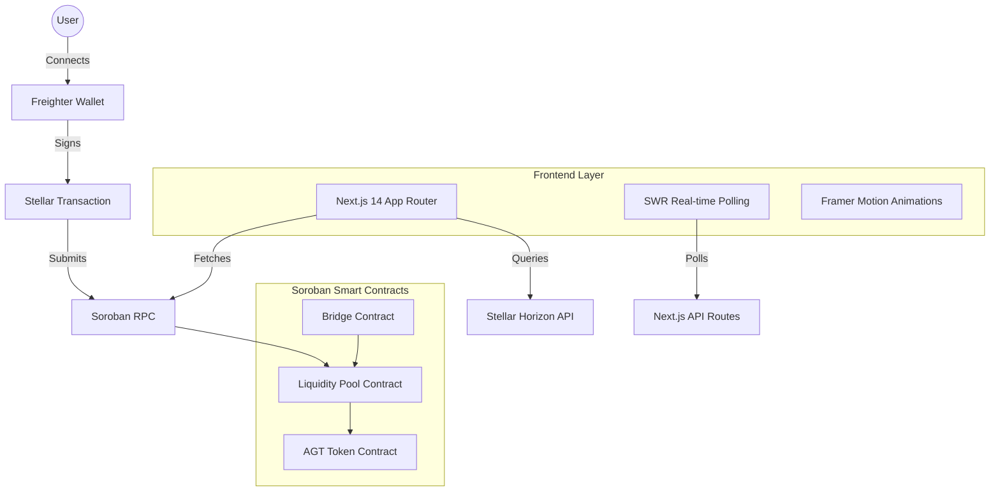

<div align="center">


# 🌌 Orbit Money

**The Next-Generation Liquidity Protocol on Stellar.**

[](https://github.com/modiv2/orbit_money/actions)
[](https://stellar.org)
[](https://soroban.stellar.org)
[](https://nextjs.org)
[](LICENSE)

[Live Demo](https://orbit-money.vercel.app) · [Report Bug](https://github.com/modiv2/orbit_money/issues) · [Request Feature](https://github.com/modiv2/orbit_money/issues)

</div>

---

## 🚀 Overview

Orbit Money is a decentralized liquidity protocol built on the **Stellar Blockchain** using **Soroban Smart Contracts**. It allows users to swap assets, provide liquidity to automated market makers (AMM), and earn yields through a streamlined, premium user interface.

### ✨ Key Features

-   **⚡ Seamless Swaps:** Instant AGT ↔ XLM swaps powered by an efficient AMM.
-   **💧 Liquidity Pools:** Provide liquidity and earn fees from every transaction.
-   **📈 Real-time Analytics:** Live price feeds and transaction streams directly from contract events.
-   **🛡️ Trustline-Gated Access:** Integrated Stellar trustline management for secure token interactions.
-   **✨ Premium UI:** A futuristic, glassmorphic design built with Framer Motion and Lucide icons.

---

## 📸 Visual Showcase

### 📱 Mobile Experience

*Optimized for mobile-first interaction with a persistent bottom navigation and real-time balance updates.*

### 🔄 Advanced Swaps

*Precision swapping with slippage protection and live rate calculations from pool reserves.*

### 🌊 Liquidity Provision

*Manage your positions with ease. Detailed pool statistics and APY tracking.*

---

## 🎥 Video Demonstration

[](https://www.youtube.com/watch?v=dQw4w9WgXcQ)
*A walkthrough of the full protocol flow: connecting wallet, adding trustline, requesting test AGT, and providing liquidity.*

---

## 🛠️ Architecture



---

## 🏗️ Technical Stack

-   **Contracts:** Rust, Soroban SDK v21
-   **Frontend:** Next.js 14, TypeScript, Vanilla CSS
-   **State Management:** SWR (Real-time polling)
-   **Animations:** Framer Motion
-   **Icons:** Lucide React
-   **Backend:** Next.js Edge Functions (API Routes)
-   **Infrastructure:** GitHub Actions (CI/CD), Vercel (Deployment)

---

## 🚦 Getting Started

### Prerequisites

-   [Stellar CLI](https://developers.stellar.org/docs/tools/stellar-cli/install)
-   [Rust & Cargo](https://rustup.rs/)
-   [Node.js 20+](https://nodejs.org/)
-   [Freighter Wallet](https://www.freighter.app/)

### Installation

1.  **Clone the repo:**
    ```bash
    git clone https://github.com/modiv2/orbit_money.git
    cd orbit_money
    ```

2.  **Build Contracts:**
    ```bash
    make build-contracts
    ```

3.  **Setup Frontend:**
    ```bash
    cd frontend
    npm install
    cp .env.example .env.local
    # Configure your environment variables
    npm run dev
    ```

---

## 📜 Contract Details

| Contract | Network | Address |
| :--- | :--- | :--- |
| **AGT Token** | Testnet | `CCHLK4RHSS27U4K6VRIP6QW2N5IGBJJES4GA4CI3RRUGP54G4FH5HL7P` |
| **Liquidity Pool** | Testnet | `CCQZXG3QGFPLRS6LJJ4XALJGUGVNLISYN6BJSVOH57ED6FYJH7KGKXAR` |
| **Bridge** | Testnet | `CBMGE6BSHIGBXAUMW32D542POCBMI3DHP7ZZGI6RTGPRECJQA3S5ZFDI` |

---

## 🤝 Contributing

Contributions are welcome! Please feel free to submit a Pull Request.

1. Fork the Project
2. Create your Feature Branch (`git checkout -b feature/AmazingFeature`)
3. Commit your Changes (`git commit -m 'Add some AmazingFeature'`)
4. Push to the Branch (`git push origin feature/AmazingFeature`)
5. Open a Pull Request

---

## ⚖️ License

Distributed under the MIT License. See `LICENSE` for more information.

<div align="center">
  <br />
  Built with ❤️ on Stellar
</div>
